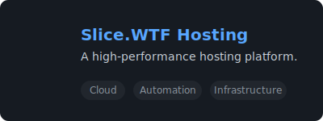
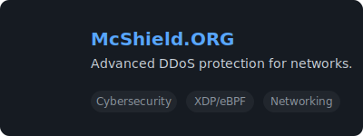
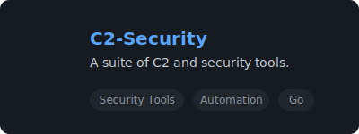

  

  
  
  

 

<table align="center">
<tr>
<td valign="top" width="50%">

### Hey there, I'm Abhishek 👋

Since 2021, I've been on a journey deep into cloud computing and cybersecurity. My passion is building resilient, scalable, and secure systems from the ground up—whether it's a full-fledged hosting business, an automated security platform, or a high-performance Minecraft network. I thrive on solving the complex puzzles that make the internet work, from bare-metal datacenters to sophisticated, ML-driven detection systems.

- 🔭 **What I'm building:** Hosting platforms, security systems, and automated infrastructure.
- 🧠 **My mindset:** Breadth-first exploration across cloud, security, networking, and SRE.
- 🎮 **For fun:** I develop and optimize Minecraft servers, focusing on performance and anti-cheat.
- ✉️ **Get in touch:** anaveragebeing2007@gmail.com

---

### 🛠️ Tech Stack & Tools

  

---

### 🌐 Connect With Me

  
  
  
  

</td>
<td valign="top" width="50%">

### 📊 GitHub Stats

  

---

### 🏆 Trophies

  

---

### 📈 Activity Graph

  

</td>
</tr>
</table>

---

### 🚀 Featured Projects

  
  
  

---

<blockquote>

### 🧩 More About My Expertise

#### ☁️ Cloud, Infra & Datacenter
- **Hosting Businesses:** Architecting and managing multi-tenant hosting platforms from scratch.
- **Datacenter Management:** Experience with bare-metal provisioning (PXE), rack design, power/cooling, and IPAM/BGP.
- **Virtualization:** Expertise in Proxmox, Virtualizor, and other hypervisors for HA clusters, live migration, and VM orchestration.

#### 🛡️ Security Systems
- **Low-Level Defense:** Building XDP/eBPF pipelines for high-performance L3/L4 DDoS mitigation.
- **Intelligent Detection:** Implementing behavior analysis and ML-driven models for threat detection.
- **Network Security:** Designing resilient networks with BGP, Anycast, and ECMP for security and scalability.

</blockquote>

